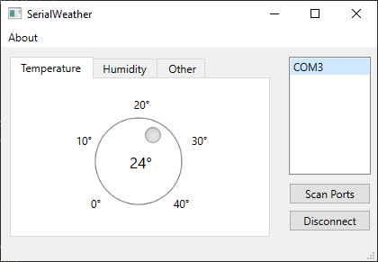
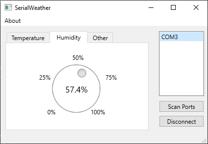

# Temperature 
This project is a mini-dashboard built with Qt and connected with an ESP32.
The ESP32 has its own firmware, where it reads a temperature/humidity sensor, parses the information and sends it over serial (USB) to the host PC, where the Qt application shows it with a fancy UI. 

## Folders
*Temperature* contains the Qt application

*SerialSensor* contains the firmware of the ESP32 written with ESP-IDF

## Temperature

## Humidity
